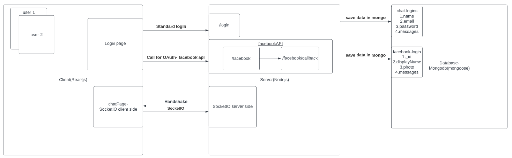

# Chaty

### Description

- Chaty is a chat application that allows you to communicate with other users via the platform.
  Each user need to open the app in their browser, first they will request to register or login,
  they can login with their privae details or with their facebook account, and only afterwards they will redirect to the chat UI. At the chat UI they'll see an input box to write their message ,and above it 
  a box with all messages from all users.
  
- I developed the server side by using Node.js and the client side by using React.js, and for database 
  I used Mongodb(mongoose).

- This is the schema of the app:
  

### Installation

In order to use the app you need to install all the dependencies.

- From CMD go to the server directory and run `npm install`. Afterwards, from CMD, go to the client directory,
  and also run `npm install`.

- The app is still in development so you need to connect to mongodb on your local machine.

- Now, from CMD, go to server directory and run `npm start`, run the same from the client directory.

- You are ready to Chat, type a message in the dedicated box and send it to everyone :)

### Upcoming

In the near future I plan to:

- Meanwhile, only the login with facebook works, I'll also fix it soon.
- Add rooms, so each group will have a private room to chat inside it.
- Save the messages inside mongodb.
- Add tests all over, using Jest.
- Add more styles to the app, using CSS.

### Contributing

The app is still in developing progress, therefore, any ideas about how to improve my app ,and pull requests will be more than welcome.
You can share me with your ideas by sending them to my Email: kobiye1@gmail.com 

### License

[MIT](https://choosealicense.com/licenses/mit/)